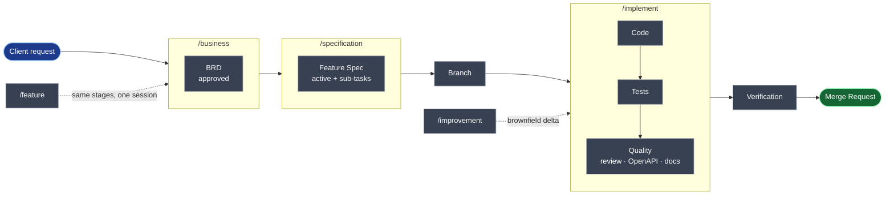

# Okinawa SDLC AI Web project template

An AI-driven **SDLC framework** — it runs the full software development life cycle (requirements → specification → implementation → verification) through structured AI commands, rules, skills, and sub-agents. Built on a **docs-first** principle: documentation is the source of truth at every stage, code is its output.

Inspired by the feature-dev Claude plugin.

---

## Pipeline

Each docs stage is the contract for the next. 

---

## Commands

`.claude/commands/`

| Command          | Purpose                                                                                      |
| ---------------- | ---------------------------------------------------------------------------------------------- |
| `/business`      | Generate a BRD from a client description (Create) or update an existing one (Update)          |
| `/specification` | BRD → feature spec (`docs/specification/`) with business rules, decisions, contracts, sub-tasks     |
| `/implement`     | Implement from ready docs — gated sub-tasks, tests, review, API docs sync                     |
| `/feature`       | Full pipeline in one session (business → spec → implement) without separate approval stages   |
| `/improvement`   | Change existing functionality — delta analysis, backward compatibility, in-place doc updates  |

Details and phase-by-phase breakdown: [`docs/infrastructure/ai/commands.md`](docs/infrastructure/ai/commands.md).

---

## Rules

`.claude/rules/` — always-loaded standards.

| Rule                  | Contents                                                             |
| --------------------- | ---------------------------------------------------------------------- |
| `workflow.md`         | Docs-first task pipeline (BRD → Spec → Branch → Code → Verification → MR) |
| `context.md`          | Context gathering strategy — Graphify → `docs/` → Serena → Grep/Glob  |
| `documentation.md`    | `docs/` layout, when to read/update                                  |
| `architecture.md`     | Structure, layers, naming                                             |
| `coding-standards.md` | Strict types, SOLID, conventions                                      |
| `environment.md`      | Host vs. containerized command routing                                |
| `verification.md`     | Pre-commit checklist — lint, migrations, tests, docs                  |

Details: [`docs/infrastructure/ai/rules.md`](docs/infrastructure/ai/rules.md).

---

## Skills

`.claude/skills/` — loaded by context.

| Skill            | Trigger                                                             |
| ---------------- | ---------------------------------------------------------------------- |
| `git`            | "create branch", "commit", "push", "create MR/PR"                    |
| `implementation` | Driving the gated sub-task delivery loop for `/implement`/`/improvement` |
| `quality`        | Post-implementation review, final tests, docs & API reconciliation     |
| `review`         | Code review — checklist, confidence scoring                          |
| `security`       | Security checklist — authorization, injection, XSS, data leaks        |
| `test`           | Test-authoring policy — what to write, when to skip                   |

Details: [`docs/infrastructure/ai/skills.md`](docs/infrastructure/ai/skills.md).

---

## Agents

`.claude/agents/` — sub-agents for pipelines.

| Agent               | Role                                                                 |
| ------------------- | --------------------------------------------------------------------- |
| `code-explorer`     | Trace execution paths, map layers, document dependencies              |
| `code-architect`    | Feature blueprints — files, data flows, build sequence                |
| `code-implementer`  | One sub-task in isolation; edits only files from the code map         |
| `code-reviewer`     | Bugs, security, conventions — confidence-based filtering               |
| `test-author`       | Functional + frontend tests mirroring project layout                   |
| `docs-author`       | Map, write, verify `docs/` — docs-first                                |
| `api-docs-author`   | Verify API vs OpenAPI spec; flag deviations; skip non-API features      |

Details: [`docs/infrastructure/ai/agents.md`](docs/infrastructure/ai/agents.md).

---

## Plugins & MCP

Discovery order (`.claude/rules/context.md`): **Graphify → `docs/` → Serena → Grep/Glob**. Plugins via `.claude/settings.json` → `enabledPlugins`.

| Tool | Source | Role |
| ---- | ------ | ---- |
| **Graphify** | CLI (`graphify-out/`) | **Primary orientation** — knowledge graph of code + docs. Run before opening files: `query` / `explain` / `path`; `update .` after code changes |
| `serena@claude-plugins-official` | official marketplace + MCP | Symbol-level navigation and edits (`get_symbols_overview` → `find_symbol`) |
| `context7@claude-plugins-official` | official marketplace | Up-to-date docs for external libraries/frameworks |
| `caveman@caveman` | custom plugin | Ultra-terse responses, lower token usage |

Setup (Serena MCP + Graphify): [`docs/infrastructure/ai/mcp.md`](docs/infrastructure/ai/mcp.md) · example config [`.claude/mcp.example.json`](.claude/mcp.example.json).

---

## Docs vault

`docs/` — an Obsidian vault. Entry point: [`docs/DOCS.md`](docs/DOCS.md).

| Layer             | Answers                                                |
| ----------------- | ------------------------------------------------------- |
| `business/`       | What the client asked for — BRDs, risks                |
| `specification/`  | Feature specs — business rules, entities, services, APIs         |
| `architecture/`   | System-level — cross-cutting concerns, decisions (ADR) |
| `testing/`        | How quality is validated                                |
| `infrastructure/` | How to run and operate — AI config                      |

Templates live in [`docs/_templates/`](docs/_templates/).

---

## Adopt for your project

This repo is a **template skeleton**, not a finished project. The pipeline, commands, rules, skills, and agents are ready to use as-is. A few files are intentionally left with placeholders or example content — fill them with **your** project's specifics.

| File                                | What to do                                                                     |
| ------------------------------------ | --------------------------------------------------------------------------------|
| `.claude/rules/architecture.md`     | Placeholders — add your structure, layers, and service-naming rules            |
| `.claude/rules/coding-standards.md` | Placeholders — add your strict-typing, SOLID, and stack conventions            |
| `.claude/rules/environment.md`      | Placeholders — set your app service name and command routing                   |
| `.claude/rules/verification.md`     | Placeholders — set your actual lint/test/migration commands                    |
| `docs/architecture/architecture.md` | Placeholder tech stack table — replace with your real stack and structure      |
| `.claude/mcp.example.json`          | Example MCP config — copy to your client config, set your project root         |
| `docs/specification/` + `src/`            | Docs demo under commerce/orders — put application code in empty `src/`         |

---

## Entry point

[`CLAUDE.md`](CLAUDE.md) — loaded automatically every session; links to the core rules.
