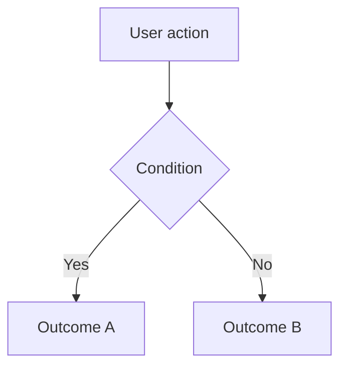

# BRD: {Feature Name}

> **Business Requirements Document** — pre-implementation analysis artifact.
> Captures stakeholder intent, scope, questions, and risks before the technical spec or implementation begins.
> For the technical spec (business rules, technical flow, contracts), see the linked `spec` in the frontmatter once created.

---

# Part 1 — For Product Owner

> This section is written in business language only. No technical details, no stack, no architecture.
> Intended audience: product owner, stakeholders, client.

---

## Original Request

> Paste the verbatim client description here, in the original language.

---

## Summary

One paragraph in English: what the client wants, the business goal, and the expected outcome.

---

## Scope

### In-Scope

- Item 1
- Item 2

### Out-of-Scope

- Item 1
- Item 2

### User Roles

| Role | How they interact with this feature |
|------|-------------------------------------|
| Admin | … |
| *(Role)* | … |

### Assumptions

- Assumption 1
- Assumption 2

---

## High-Level Flow

---

## Stakeholder Questions

> Numbered and grouped. Each question should have a proposed default answer where possible.

### UX / User Flow

1. **Q**: …
   **Why**: …
   **Default**: …
   **Status**: open
   **Answer**: —

### Business Logic

2. **Q**: …
   **Why**: …
   **Default**: …
   **Status**: open
   **Answer**: —

### Permissions & Access

3. **Q**: …
   **Why**: …
   **Default**: …
   **Status**: open
   **Answer**: —

### Data & Content

4. **Q**: …
   **Why**: …
   **Default**: …
   **Status**: open
   **Answer**: —

---

## Functional Requirements

> Derived from the request and stakeholder answers. Use SHALL (mandatory) / SHOULD (recommended) / MAY (optional).
> Business language only — no implementation details.

| # | Requirement | Priority |
|---|-------------|----------|
| FR-1 | The system SHALL … | Must-have |
| FR-2 | The system SHOULD … | Should-have |
| FR-3 | The system MAY … | Nice-to-have |

---

## Edge Cases & Error Scenarios

| Scenario | Expected behaviour |
|----------|--------------------|
| … | … |

---

## Risks & Mitigation

| Risk | Probability | Impact | Mitigation |
|------|-------------|--------|------------|
| … | Low / Medium / High | Low / Medium / High | … |

---

## Acceptance Criteria

> High-level verifiable conditions from the business perspective.

- [ ] AC-1: …
- [ ] AC-2: …
- [ ] AC-3: …

---

# Part 2 — Technical Impact (Internal)

> This section is for the development team only.
> Captures implementation-level impact, domain concerns, and estimation factors.

---

## Affected Modules & Components

> Fill in only what applies. Severity: **High** (breaking/structural) / **Medium** (additive) / **Low** (cosmetic/config).

| Module / Submodule | Layer | What changes | Severity |
|--------|-------|-------------|----------|
| `{module}/{submodule}` | Entity / data model | New/changed fields: … | High |
| `{module}/{submodule}` | Repository / data access | New queries: … | Medium |
| `{module}/{submodule}` | Service layer | New/changed business logic: … | Medium |
| `{module}/{submodule}` | Controller / API | New/changed endpoints: … | Medium |
| `{module}/{submodule}` | Request/response DTOs | New/changed input/output contracts: … | Low |
| `{module}/{submodule}` | Data table / listing | New columns/filters: … | Low |
| `{module}/{submodule}` | Async processing | New queues, jobs, handlers: … | Medium |
| `{module}/{submodule}` | Events / listeners | New/changed events: … | Low |
| `{module}/{submodule}` | Enums / constants | New values: … | Low |
| `{module}/{submodule}` | Console commands | New CLI tools or scripts: … | Low |
| `{module}/{submodule}` | Schema migrations | New tables, columns, indexes: … | High |
| `{module}/{submodule}` | Search / indexing | New fields in search index: … | High |
| `{module}/{submodule}` | Export | New export type or columns: … | Medium |
| `{module}/{submodule}` | Analytics / reporting | New fields in dashboards or reports: … | High |
| `{module}/{submodule}` | Permissions / authorization | New roles or access rules: … | High |
| `{module}/{submodule}` | Audit trail | Change logging for entities: … | Medium |
| `{module}/{submodule}` | Translations / localization | New strings or locales: … | Low |
| `{module}/{submodule}` | Sensitive data handling | PII, masking, encryption: … | High |
| `{module}/{submodule}` | Pages / views | New/changed screens or components: … | Medium |
| `{module}/{submodule}` | State management | Store, context, composables: … | Medium |
| `{module}/{submodule}` | API integration | Client calls to new/changed endpoints: … | Medium |
| `{module}/{submodule}` | Forms / validation | Form fields, client-side validation: … | Low |
| `{module}/{submodule}` | Styling | CSS, theme, design system: … | Low |

---

## Non-Functional Requirements

| Area | Requirement |
|------|-------------|
| Performance | … (e.g. export completes within 60s for up to 10 000 rows) |
| Security | … (e.g. endpoint requires role-based + resource-level authorization) |
| Compliance | … (e.g. audit trail required for changed records) |
| Accessibility | … (e.g. new UI controls keyboard-navigable) |
| Localization | … (e.g. new translatable strings, date/number formats) |

---

## Data Impact

### New / Changed Entities & Fields

| Entity | Field | Type | Nullable | Notes |
|--------|-------|------|----------|-------|
| `{Entity}` | `{field}` | `string` | No | … |

### Migration

- [ ] Database migration required
- [ ] Data backfill required — strategy: …

### Search / indexing

- [ ] New mapping fields required — index: …
- [ ] Re-indexing required — estimated volume: …

---

## Domain Checklist

> Check each item: **Yes** / **No** / **TBD** (needs stakeholder answer).

| Domain concern | Status | Notes |
|----------------|--------|-------|
| Audit trail required for changed entities | TBD | |
| New/changed translatable strings | TBD | |
| New permissions or access rules | TBD | |
| New fields visible in analytics / reporting | TBD | |
| New export type or columns | TBD | |
| Search index mapping changes / re-index needed | TBD | |
| Sensitive data involved | TBD | If Yes: apply masking/encryption per policy |
| Affects existing scheduled jobs or async workflows | TBD | |

---

## Dependencies & Integration Points

### Internal dependencies

| Module / Submodule | Dependency type | Reason |
|--------|----------------|--------|
| `{module}/{submodule}` | Entity / Service / Event | … |

### External APIs / Services

| Service | Dependency type | Reason |
|---------|----------------|--------|
| … | … | … |

---

## Estimation Factors

### Complexity Drivers

- …

### Unknowns / Open Decisions

- …

### Comparable Existing Features

| Feature | Module / Submodule | Notes |
|---------|--------|-------|
| … | … | Similar pattern, estimated X days |

---

## Open Items

> Unresolved questions that must be answered before the spec phase begins.
> Format: `Q{N}: {short description}`. Updated automatically by `/business` update mode.

- [ ] Q1: …
