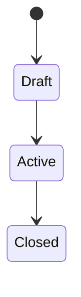
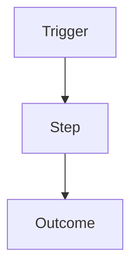

> **Required:** Purpose + Submodules table.
> **Optional:** *Module specification* — shared context for the whole module (not a feature BRD/spec).
> Inside that block, include only subsections that apply; omit empty ones.

# {Module}

**Purpose:** One-sentence description of the domain this module owns.

**Layer:** `{business | specification}`

---

## Submodules

| Submodule | Description | Index |
| --------- | ----------- | ----- |
| `{Submodule}` | *(one-line purpose)* | [[./{submodule}/{submodule}\|{submodule}/]] |

---

## Module specification *(optional)*

> Cross-submodule language. Feature-specific intent stays in BRDs / feature specs.

### Overview

*(What this module owns, who uses it, how it relates to other modules.)*

### Actors & roles

| Role | How they interact with this module |
|------|------------------------------------|
| `{Role}` | … |

### Core concepts

| Term | Meaning |
|------|---------|
| `{Term}` | … |

### Scope & boundaries

| In scope | Out of scope |
|----------|--------------|
| … | … |

### Lifecycle / states

> Shared statuses or phases that several submodules must respect. Omit if none.

| State | Meaning | Allowed transitions |
|-------|---------|---------------------|
| `{State}` | … | → `{Next}` |

### Shared flows

> Module-wide flows that are not owned by a single feature. Omit if none.

### Business rules

| # | Rule | Notes |
|---|------|-------|
| MR-01 | The system SHALL … | … |
| MR-02 | The system SHOULD … | … |

### Edge cases & invariants

| Scenario / invariant | Expected behaviour |
|----------------------|--------------------|
| … | … |

### Data ownership

| Concept | Owner (submodule) | Notes |
|---------|-------------------|-------|
| `{Entity or aggregate}` | `{submodule}` | … |

### Non-functional constraints

| Area | Constraint |
|------|------------|
| Performance | … |
| Security | … |
| Compliance / audit | … |
| Localization | … |

### Permissions model

| Permission / policy | Who | Scope |
|---------------------|-----|-------|
| `{PERMISSION}` | `{Role}` | module-wide / resource |

### Dependencies & integrations

| Module / Submodule / System | Kind | Why |
|-----------------------------|------|-----|
| `{module}/{submodule}` | uses / used-by / sync / async | … |

### Risks & open items

| Item | Type | Status | Notes |
|------|------|--------|-------|
| … | risk / question | open / decided | … |

### Notes

*(Quirks, deprecations, non-obvious constraints)*
