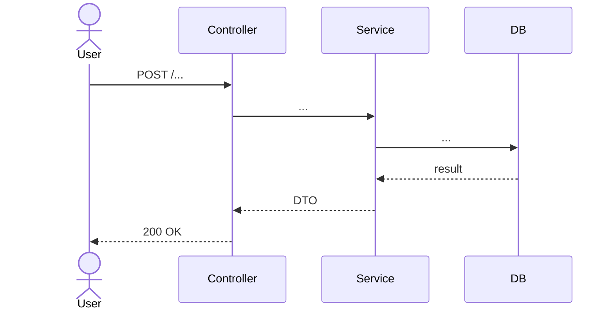

# {Feature Name}

**Module:** [[../{module}|{module}]] → [[./{submodule}|{submodule}]]
**BRD:** [[../../../business/{module}/{submodule}/{feature}|{BRD title}]] *(client requirements)*

> This spec is the technical source of truth: business rules, decisions, and
> contracts live here. User flows and acceptance criteria stay in the BRD.

---

## Overview

What this feature does in one paragraph.

---

## Technical flow

> Sequence of internal calls (Controller → Service → DB). This is the *technical*
> flow — the business-level user flow lives in the BRD (User flow section).

---

## Code map

| Type | Path | Role |
|------|------|------|
| Controller / handler | `{Controller}` | HTTP entry, permission check |
| Service | `{Service}` | Business logic |
| DTO | `{DTO}` | Input/output contract |
| Repository | `{Repository}` | Data access |
| Page / view | `{Page}` | Screen entry point |
| Component | `{Component}` | Reusable UI piece |
| Composable / store | `{useFeature}` | Client state and API calls |

---

## Permissions

| Permission | Value | Check type |
|-----------|-------|------------|
| `{PERMISSION}` | `{role or policy}` | Entry point (controller / route handler) |

### Resource-level checks / Voters *(if applicable)*

| Check | Subject | Logic |
|-------|---------|-------|
| `{Policy}` or `{Voter}` | `{Entity}` | Access rule description |

---

## Contracts

### Input

| Field | Type | Constraints | Notes |
|-------|------|-------------|-------|
| `{field}` | `string` | required, max 255 | … |

### Output

| Field | Type | Exposed | Notes |
|-------|------|---------|-------|
| `{field}` | `string` | yes | … |

---

## Admin UI *(if applicable)*

| Component | Path | Notes |
|-----------|------|-------|
| Data table / listing | `{ListingType}` | Columns: … |
| Filters | `{FilterFactory}` | Fields: … |

---

## Frontend *(if applicable)*

| Type | Path | Role |
|------|------|------|
| Page | `{Page}` | Main screen |
| Component | `{Component}` | Form, list item, modal, etc. |
| Composable / hook | `{useFeature}` | API calls, validation, state |

---

## Async processing *(if applicable)*

| Message / job | Handler | Trigger | Purpose |
|---------------|---------|---------|---------|
| `{Message}` | `{Handler}` | `{Service}` | … |

---

## Business rules

> Formal rules derived from the BRD — the source of truth for domain behaviour.

- **BR-01** — rule description
- **BR-02** — rule description

---

## Edge cases

- **EC-01** — scenario → expected behaviour / how handled in code

---

## Decisions

- **DEC-01**
  **Decision:** what was decided
  **Considered:** what alternatives were evaluated
  **Rationale:** why this option was chosen

---

## Testing

| Test | Type | What it covers |
|------|------|----------------|
| `{CreateEntityTest}` | integration / API | POST endpoint, validation, permissions |
| `{ComponentTest}` | unit / component | Props, events, validation |

---

## Implementation notes

*(Non-obvious decisions, workarounds, known debt)*

---

## Implementation Sub-tasks

> Numbered in strict dependency order (migration → entity → repository → service → controller/API → UI → tests).

### Sub-task 1: {Name}

**Goal**: …
**Layers**: Entity / data model / migration
**Files to create/modify**:
- `{path/to/entity}` — …
- `{path/to/migration}` — …

**Definition of done**: Migration runs, entity loads, linter passes
