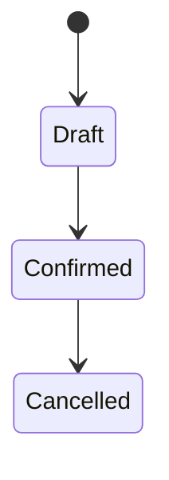
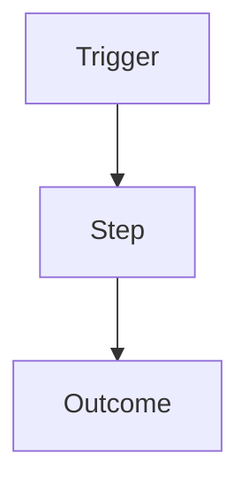

> **Required:** Purpose + Features table (and Structure when `layer: specification`).
> **Optional:** *Submodule specification* — add when the submodule needs shared context beyond the feature map.
> Technical inventory sections (Entities, Services, …) apply to `layer: specification`; omit them on `layer: business`.

# {Submodule}

**Purpose:** One-sentence description of what this submodule owns.

**Layer:** `{business | specification}`

**Path:** `{path/to/code}` *(specification layer; omit on business)*

**Cross-link:** [[path to the twin index on the other layer]]

---

## Features

| Feature | Status | Doc |
|---------|--------|-----|
| `{Feature Name}` | draft / active / deprecated | [[./{feature}\|{Feature Name}]] |

---

## Submodule specification *(optional)*

> Shared context for the whole submodule — not a single-feature BRD/spec.
> Skip the whole block if the Features table is enough. Inside the block, include only subsections that apply.

### Overview

*(What this submodule owns, main flows, relation to sibling submodules.)*

### Actors & roles

| Role | How they interact with this submodule |
|------|---------------------------------------|
| `{Role}` | … |

### Core concepts

| Term | Meaning |
|------|---------|
| `{Term}` | … |

### Scope & boundaries

| In scope | Out of scope |
|----------|--------------|
| … | … |

### Lifecycle / states



| State | Meaning | Allowed transitions |
|-------|---------|---------------------|
| `{State}` | … | → `{Next}` |

### Shared flows

> Cross-feature flows owned by this submodule. Feature-only flows stay in the BRD / feature spec.



### Business rules

| # | Rule | Notes |
|---|------|-------|
| SR-01 | The system SHALL … | … |
| SR-02 | The system SHOULD … | … |

### Edge cases & invariants

| Scenario / invariant | Expected behaviour |
|----------------------|--------------------|
| … | … |

### Data ownership

| Concept | Notes |
|---------|-------|
| `{Entity or aggregate}` | fields / invariants shared across features |

### Non-functional constraints

| Area | Constraint |
|------|------------|
| Performance | … |
| Security | … |
| Compliance / audit | … |
| Localization | … |

### Permissions model

| Permission / policy | Who | Scope |
|---------------------|-----|-------|
| `{PERMISSION}` | `{Role}` | submodule / resource |

### Dependencies & integrations

| Module / Submodule / System | Kind | Why |
|-----------------------------|------|-----|
| `{module}/{submodule}` | uses / used-by / sync / async | … |

### Risks & open items

| Item | Type | Status | Notes |
|------|------|--------|-------|
| … | risk / question | open / decided | … |

### Notes

*(Quirks, deprecations, non-obvious constraints)*

---

## Structure *(specification layer)*

> **MANDATORY** when `layer: specification`: list every real directory and file — no `...` / `etc.` omissions.

```
{Name}/
├── models/ or entities/
├── repositories/
├── services/
├── controllers/ or handlers/
├── dto/
├── forms/
├── data-tables/ or listings/
├── async/ or jobs/
├── events/
├── commands/
└── frontend/
    ├── pages/
    ├── components/
    ├── composables/ or hooks/
    └── styles/
```

---

## Entities / Data models *(specification layer)*

| Path | Responsibility |
|------|----------------|
| `{Entity}` | *(what this entity represents and owns)* |

---

## Forms *(specification layer)*

| Path | Purpose |
|------|---------|
| `{FormName}` | *(what this form handles)* |

---

## Services *(specification layer)*

| Path | Responsibility |
|------|----------------|
| `{Entity}Creator` or `{Entity}Service` | Creates a new instance |
| `{Entity}Editor` or `{Entity}Service` | Updates an existing instance |
| `{Entity}Provider` | Retrieval, filtering, statistics |
| `{Entity}Resolver` | Lookup by ID / code / DTO |

---

## Async processing *(specification layer)*

### Messages / jobs

| Path | Dispatched by | Description |
|------|---------------|-------------|
| `{Message}` | *(command, service, or controller)* | *(intent)* |

### Handlers / workers

| Path | Responsibility |
|------|----------------|
| `{Handler}` | *(why needed)* |

---

## Events *(specification layer)*

### Events

| Path | When fired |
|------|------------|
| `{Event}` | *(when/why)* |

### Listeners

| Path | Responsibility |
|------|----------------|
| `{Listener}` | *(why needed)* |

---

## Key enums / constants *(specification layer)*

| Path | Purpose |
|------|---------|
| `{Enum}` | *(what it controls)* |

---

## Contracts (interfaces) *(specification layer)*

| Path | Responsibility |
|------|----------------|
| `{Interface}` | *(capability)* |

---

## Permissions *(specification layer)*

### Role permissions

| Permission | Used in |
|-----------|---------|
| `{PERMISSION}` | `{Controller}::{action}()` |

### Resource-level checks

| Check | Subject | Logic |
|-------|---------|-------|
| `{Policy}` or `{Voter}` | `{Entity}` | *(access rule)* |

---

## API endpoints *(specification layer)*

| Method | Path | Description |
|--------|------|-------------|
| `GET` | `/api/...` | *(what it returns)* |

---

## Data tables / listings *(specification layer)*

| Type / adapter | Entity | Frontend controller | Notes |
|----------------|--------|---------------------|-------|
| `{ListingType}` | `{Entity}` | `{listing}_controller` | … |

---

## Filters *(specification layer)*

| Factory / builder | Fields | Notes |
|-------------------|--------|-------|
| `{FilterFactory}` | `name`, `status`, … | … |

---

## Commands *(specification layer)*

| Command | Path | Purpose |
|---------|------|---------|
| `{command:name}` | `{Command}` | *(workflow)* |

---

## Frontend *(specification layer)*

### Pages / views

| Path | Purpose |
|------|---------|
| `{Page}` | *(screen)* |

### Components

| Path | Purpose |
|------|---------|
| `{Component}` | *(reusable UI)* |

### State / composables

| Path | Purpose |
|------|---------|
| `{useFeature}` or `{store}` | *(shared state / API)* |
