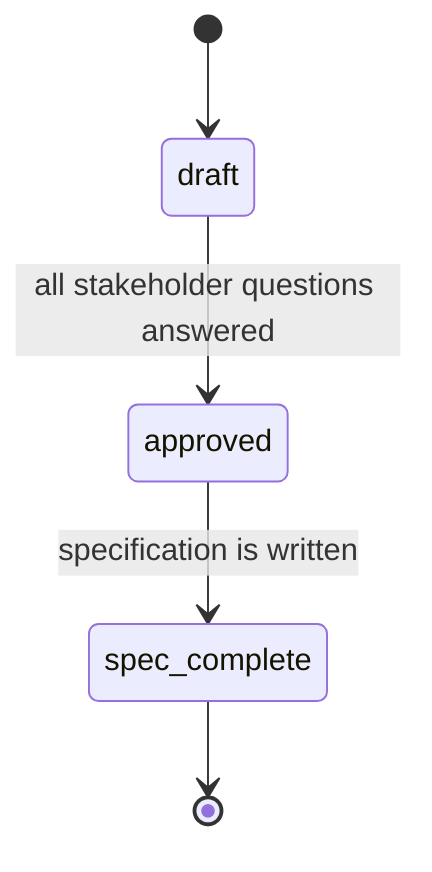

# Business Requirements

Pre-implementation analysis artifacts.
Each BRD captures stakeholder intent, business rules, edge cases, and risks — before technical design or implementation begins.

---

## Modules

| Module | Description | Index |
| ------ | ----------- | ----- |
| Commerce | Order lifecycle | [[commerce/commerce\|commerce/]] |

---

## BRD Lifecycle

| Status          | Meaning                                                          |
| --------------- | ----------------------------------------------------------------- |
| `draft`         | BRD created, stakeholder questions open — not ready for the spec |
| `approved`      | All questions answered, scope confirmed                          |
| `spec-complete` | Feature spec generated in `docs/specification/`                        |

