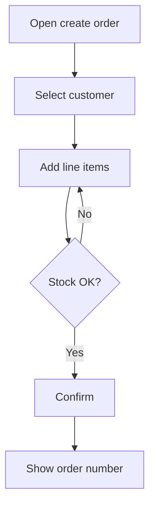

# BRD: Create order

---

# Part 1 — For Product Owner

## Original Request

> Operator should be able to create an order for a customer with line items and a delivery address.

## Summary

Allow an authenticated operator to create a new order: pick a customer, add line items, set a delivery address, and confirm. The system validates stock and returns an order number.

## Scope

### In-Scope

- Create order with customer, line items, delivery address
- Stock check before confirm
- Order number returned to the operator

### Out-of-Scope

- Payment capture
- Shipping carrier integration

### User Roles

| Role | How they interact with this feature |
|------|-------------------------------------|
| Operator | Creates and confirms orders |
| Admin | Same as operator + can create for any customer |

## High-Level Flow

## Stakeholder Questions

1. **Q**: Can an order be saved as draft before confirm?
   - **Default**: No — only confirmed orders are stored.
   - **Status**: answered
   - **Answer**: Yes, draft is allowed; confirm is a separate action.

## Acceptance Criteria

- Operator can create an order with at least one line item
- Confirm fails when any line item is out of stock
- Confirmed order gets a unique order number

---

# Part 2 — For Engineering

## Affected Modules

| Module / Submodule | Impact |
|--------------------|--------|
| Commerce / Orders | Owns the flow |

## Domain Checklist

| Concern | Needed? | Notes |
|---------|---------|-------|
| Audit | yes | Who created / confirmed |
| Permissions | yes | Operator / Admin |
| Search indexing | no | |
| Export | no | |
| Sensitive data | yes | Customer address |
