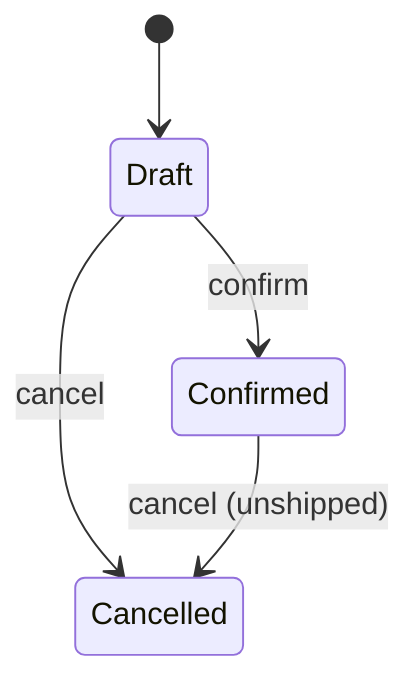
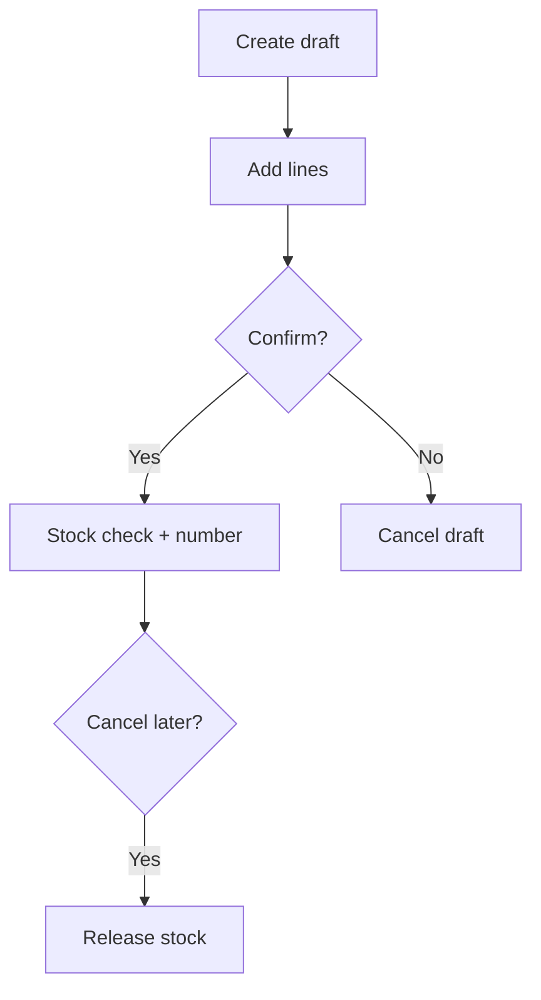

# Orders

**Purpose:** Order lifecycle within the Commerce module.

**Layer:** `business`

**Cross-link:** [[../../../specification/commerce/orders/orders|Orders (specification)]]

---

## Features

| Feature | Status | Doc |
| ------- | ------ | --- |
| Create order | approved | [[create-order\|Create order]] |
| Cancel order | draft | [[cancel-order\|Cancel order]] |

---

## Submodule specification

### Overview

Covers create → confirm → cancel. Shipping and returns are out of scope for current BRDs.

### Actors & roles

| Role | How they interact with this submodule |
|------|---------------------------------------|
| Operator | Creates drafts, confirms, cancels |
| Customer | Subject of the order (may not use UI yet) |

### Core concepts

| Term | Meaning |
|------|---------|
| Draft | Editable order before number assignment |
| Confirmed | Immutable number assigned; stock reserved |
| Cancelled | Terminal; stock released if it was reserved |

### Scope & boundaries

| In scope | Out of scope |
|----------|--------------|
| Create draft, confirm, cancel | Ship, return, partial cancel |

### Lifecycle / states

| State | Meaning | Allowed transitions |
|-------|---------|---------------------|
| Draft | No permanent number | → Confirmed, Cancelled |
| Confirmed | Number assigned, stock held | → Cancelled (if unshipped) |
| Cancelled | Terminal | — |

### Shared flows

### Business rules

| # | Rule | Notes |
|---|------|-------|
| SR-01 | Only unshipped orders MAY be cancelled | Applies to confirm + cancel features |
| SR-02 | Confirming a draft SHALL assign a permanent order number | Number never reused |
| SR-03 | Confirm SHALL fail if any line fails stock check | No partial confirm |

### Edge cases & invariants

| Scenario / invariant | Expected behaviour |
|----------------------|--------------------|
| Cancel already cancelled | No-op or clear business error; no double stock release |
| Confirm empty order | Rejected |

### Data ownership

| Concept | Notes |
|---------|-------|
| Order | status, customer, number, currency |
| OrderLine | product ref, qty, unit price |

### Permissions model

| Permission / policy | Who | Scope |
|---------------------|-----|-------|
| ORDER_MANAGE | Operator | create / confirm / cancel |
