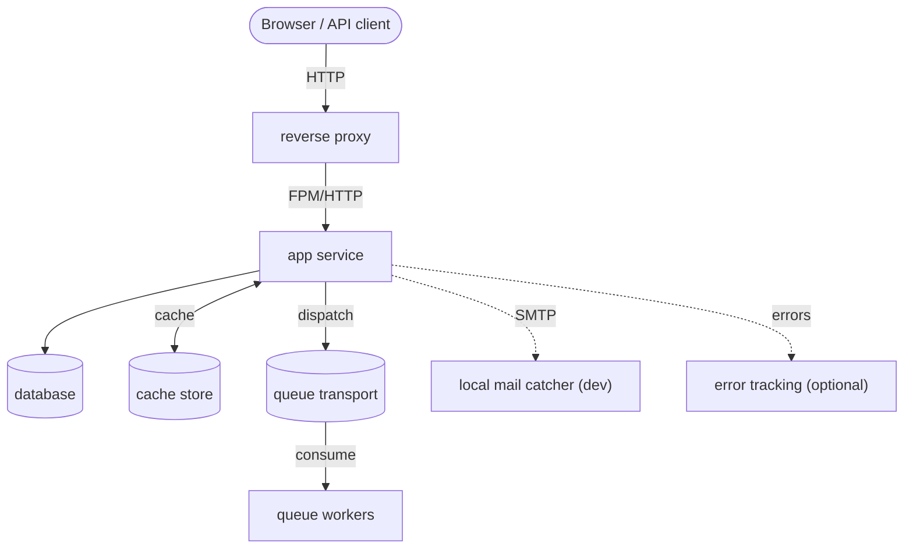

# Infrastructure Overview

Runtime environment and operational setup. Fill in with your project's actual stack.

---

## Contents

| Document | Description |
|---|---|
| [[./local-setup\|Local setup]] | Local services, first run steps, common commands |
| [[./env\|Environment variables]] | All environment variables grouped by subsystem |
| [[./queue\|Queue workers]] | Async queue workers, parallel processes, logs |
| [[./cron\|Scheduled tasks]] | Periodic commands and owning modules |
| [[./release-flow\|Release flow]] | Branching and versioning model |
| [[./ai/ai\|AI]] | Rules, commands, skills, agents, and MCP servers for the AI assistant |

---

## Runtime stack

*(Replace with your project's actual services and ports.)*

