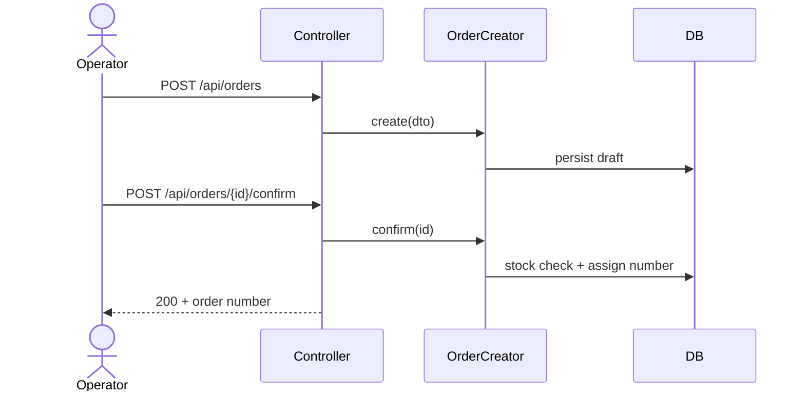

# Create order

**Module:** [[../commerce|Commerce]] → [[./orders|Orders]]
**BRD:** [[../../../business/commerce/orders/create-order|Create order]]

---

## Overview

Operator creates a draft order, adds lines, then confirms. Confirm runs a stock check and assigns an order number.

---

## Technical flow

---

## Code map

| Type | Path | Role |
|------|------|------|
| Controller | `OrderController` | HTTP entry, permission check |
| Service | `OrderCreator` | Create / confirm logic |
| DTO | `CreateOrderDTO` | Input contract |
| Repository | `OrderRepository` | Persistence |
| Page | `OrderCreatePage` | Operator screen |

---

## Permissions

| Permission | Value | Check type |
|-----------|-------|------------|
| ORDER_CREATE | Operator, Admin | Entry point |

---

## Contracts

### Input

| Field | Type | Constraints | Notes |
|-------|------|-------------|-------|
| customerId | string/uuid | required | |
| lines[].productId | string/uuid | required | |
| lines[].quantity | int | > 0 | |
| deliveryAddress | object | required on confirm | |

### Output

| Field | Type | Notes |
|-------|------|-------|
| id | string/uuid | |
| number | string | set on confirm |
| status | enum | draft / confirmed |

---

## Business Rules

1. Draft may be saved without a delivery address; confirm requires it.
2. Confirm fails if any line is out of stock.
3. Order number is unique and immutable after confirm.

---

## Decisions

| Decision | Choice | Why |
|----------|--------|-----|
| Draft support | Yes | Answered in BRD Q1 |

---

## Sub-tasks

| # | Name | Layers | Definition of done |
|---|------|--------|--------------------|
| 1 | Order + OrderLine entities | Entity, migration | Schema migrates; entities mapped |
| 2 | OrderCreator create/confirm | Service, Repository | Stock check + number assignment |
| 3 | API endpoints | Controller, DTO | POST create/confirm green in functional tests |
| 4 | Operator create page | Frontend | Happy path + stock-fail message |
