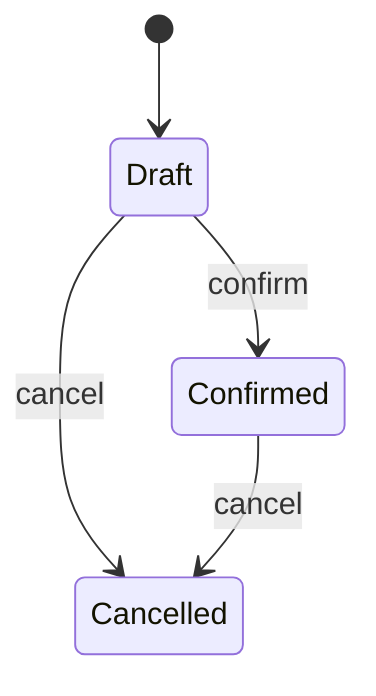

# Orders

**Purpose:** Order entity, create/cancel flows, and operator UI.

**Layer:** `specification`

**Path:** `{src/Order}`

**Cross-link:** [[../../../business/commerce/orders/orders|Orders (business)]]

---

## Features

| Feature | Status | Doc |
|---------|--------|-----|
| Create order | active | [[./create-order\|Create order]] |
| Cancel order | — | *(spec not written yet — BRD still draft)* |

---

## Submodule specification

### Overview

Shared context for Order code under `{src/Order}`. Feature-level behaviour lives in feature specs; rules and lifecycle here apply to every Orders feature.

### Core concepts

| Term | Meaning |
|------|---------|
| Draft | Editable; no `number` |
| Confirmed | `number` set; stock reserved |
| Cancelled | Terminal; stock released if reserved |

### Lifecycle / states



| State | Meaning | Allowed transitions |
|-------|---------|---------------------|
| Draft | No permanent number | → Confirmed, Cancelled |
| Confirmed | Number + stock hold | → Cancelled (not shipped) |
| Cancelled | Terminal | — |

### Business rules

| # | Rule | Notes |
|---|------|-------|
| SR-01 | Cancel SHALL be rejected when status is `shipped` | Shared by cancel path |
| SR-02 | Confirm SHALL run stock check, then assign order number | Atomic; no partial confirm |
| SR-03 | Order number SHALL never be reused | |

### Edge cases & invariants

| Scenario / invariant | Expected behaviour |
|----------------------|--------------------|
| Double cancel | Idempotent success or domain error; no double stock release |
| Confirm with zero lines | 422 / domain rejection |

### Permissions model

| Permission / policy | Who | Scope |
|---------------------|-----|-------|
| ORDER_MANAGE | Operator | create / confirm / cancel endpoints |

### Dependencies & integrations

| Module / Submodule / System | Kind | Why |
|-----------------------------|------|-----|
| catalog *(future)* | uses | resolve SKU on line create |
| stock *(future)* | sync | reserve / release on confirm / cancel |

---

## Structure

```
Order/
├── Entity/
├── Repository/
├── Service/
├── Controller/
├── DTO/
└── frontend/
    ├── pages/
    └── components/
```

---

## Entities / Data models

| Path | Responsibility |
|------|----------------|
| Order | Order header: customer, status, number |
| OrderLine | Line item: product, qty, price |

---

## Services

| Path | Responsibility |
|------|----------------|
| OrderCreator | Creates draft / confirms order |
| OrderCanceller | Cancels unshipped order, releases stock |

---

## API endpoints

OpenAPI: [`openapi.yaml`](../../../../openapi.yaml) (repo root) · conventions: [[../../../architecture/cross-cutting/api|api.md]]

| Method | Path | Description |
|--------|------|-------------|
| `POST` | `/api/orders` | Create draft order |
| `POST` | `/api/orders/{id}/confirm` | Confirm draft (stock check + number) |
| `POST` | `/api/orders/{id}/cancel` | Cancel unshipped order |
