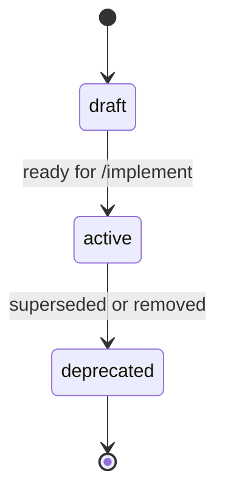

# Specification

Technical source of truth for features: business rules, entities, services, APIs.
Layout matches business: **module → submodule → feature**.

---

## Modules

| Module | Description | Index |
| ------ | ----------- | ----- |
| Commerce | Order lifecycle | [[commerce/commerce\|commerce/]] |

---

## Spec Lifecycle

| Status       | Meaning                                                                 |
| ------------ | ----------------------------------------------------------------------- |
| `draft`      | Spec is being written or revised — not ready to implement               |
| `active`     | Spec approved; `/implement` (or further work) may proceed from it       |
| `deprecated` | Spec superseded or feature retired — keep for history, do not extend    |

Frontmatter `status` on each `specification/{module}/{submodule}/{feature}.md` uses these values.
The Features table in the submodule index should mirror the same status.
BRD side stays separate: when the first usable spec exists, BRD becomes `spec-complete`.
