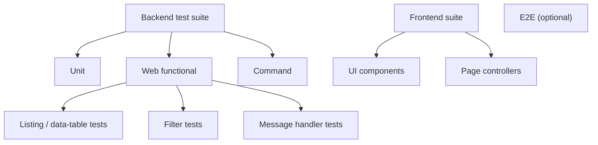

# Testing Overview

Testing strategy. Fill in with your stack's actual test runners and commands.

---

## Test pyramid

1. **Unit** — fast isolated logic checks without a framework kernel or DB
2. **Web functional** — the main integration layer for most projects
3. **Specialized subtypes** — command, message-handler, listing/data-table, filter tests built on the same test foundation
4. **Frontend** — component and page-controller tests, separate from the backend suite
5. **E2E** *(if applicable)* — browser automation against a deployed environment

> **Authoring policy:** new feature/improvement work is covered via the **functional
> types** (web functional/API, message-handler, listing, command, filter). **Unit tests**
> are used **selectively** for pure isolated logic — we do not add a test per class.
> A sub-task with **no testable surface** (foundational entity/migration/DTO/enum) may ship
> **without new tests**, covered later by the consuming surface. The actionable rule set
> the AI pipeline follows lives in `.claude/skills/test/SKILL.md`.

---

## Suite structure



---

## Core foundation

| Base class | Purpose |
|---|---|
| `{shared test-case base class}` | Shared test foundation: fixtures, DB transaction, auth helpers, request helpers |
| `{unit test base class}` | Pure unit tests without kernel boot |

---

## Running tests

```bash
# Full suite + quality gates
{pre-commit / quality-gate command}
```

```bash
# Backend, targeted run
{test command} --filter <TestClass>
```
